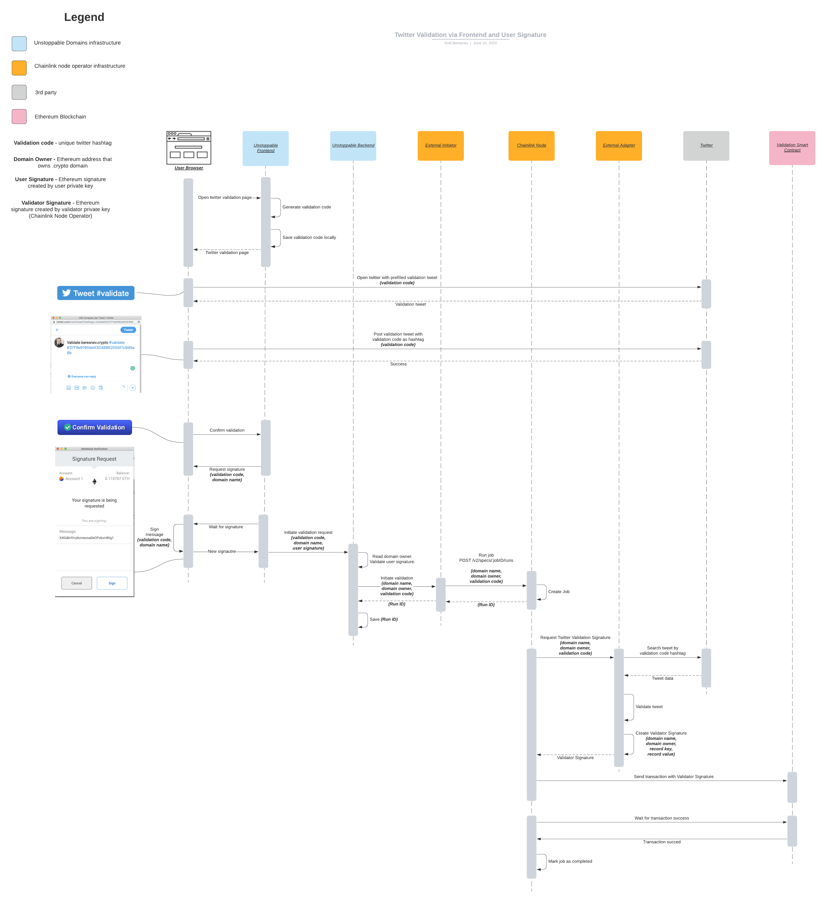

# Chainlink External Adapter and External Initiator for twitter validation

## Why it exists
This repository consists [External Adapter](https://docs.chain.link/docs/external-adapters) and 
[External Initiator](https://docs.chain.link/docs/initiators#external) for [Chainlink](https://chain.link) Node which supports validation of 
user twitter account on Ethereum Blockchain using .crypto domains. 

## Architecture overview
### Validation flow diagram

## Important points
* [How Chainlink works](https://www.kaleido.io/blockchain-blog/how-chainlink-works-under-the-covers)    
* [How External Initiator works](https://medium.com/secure-data-links/chainlink-external-initiators-e8c49ff885b3)  
* [How External Adapter works](https://medium.com/chainlink/chainlink-external-adapters-e9f99cd6cb62)  

